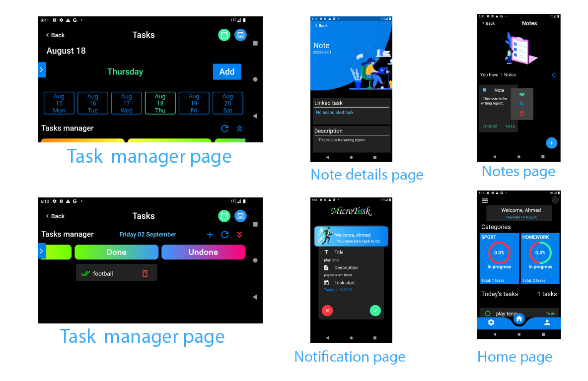

## Description:

This project is an advanced to do list which contain most common functionalities used to manage a list of tasks like reminders, tasks of today and notes. In addition to those Microtask have also some  Trello functionalities  which help to organize tasks more efficient, also the user can separate there tasks logically by creating categories and that help to find out a specific tasks fast.

## installation: 

Follow those commands to install the project :
   
       git clone https://github.com/Ahmed2000Github/MicroTask.git
       flutter pub get 
       flutter pub upgrade
       flutter pub run flutter_native_splash:create
       flutter packages pub run build_runner build
             
## usage:         
          
       flutter run --no-sound-null-safety
             

## Some screens from the app: 

### [See all screens ](./screens/)
